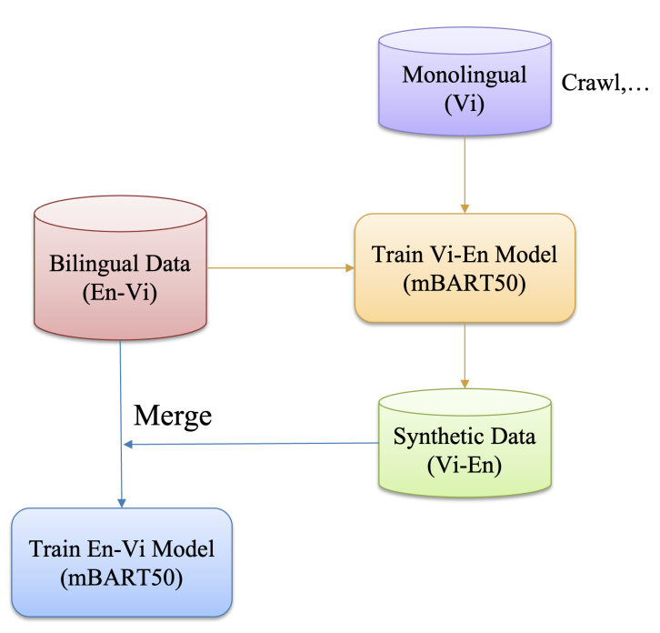
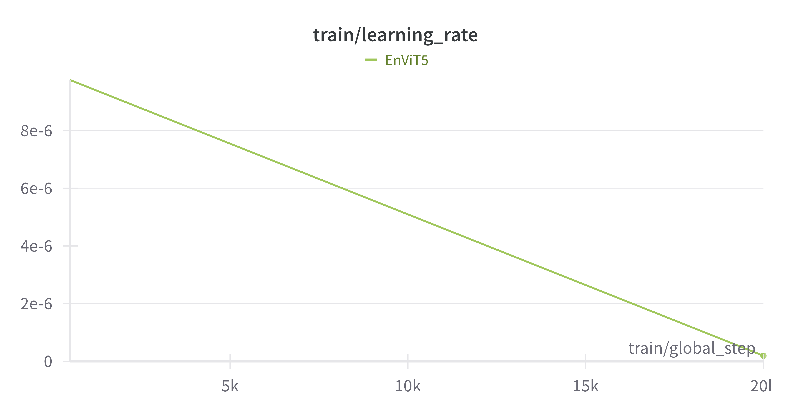
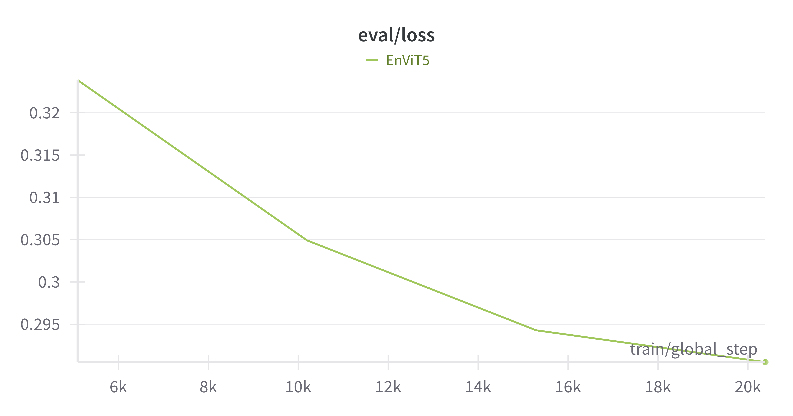
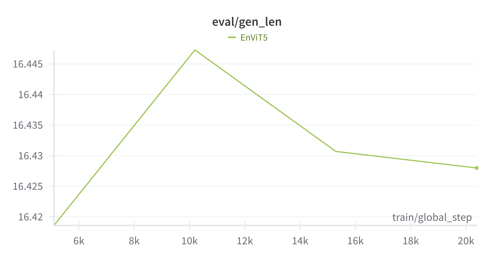
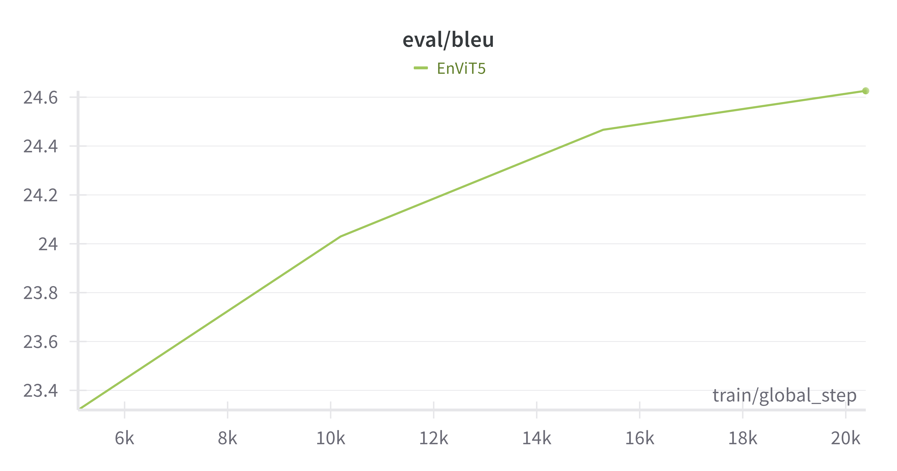

# Eng-Viet Low Resource Machine Translation

## Table of contents

## Introduction

This project implements a machine translation system that translates text from English to Vietnamese using the mBART50 pretrained model. By leveraging advanced techniques such as back-translation, the system ensures high-quality translations. The combination of mBART50 and back-translation enhances accuracy and fluency, making this translator suitable for various applications.

## Models

### MBart50

The mBART50 model is a powerful multilingual machine translation model developed by Facebook AI. It is trained on a massive dataset of 50 languages, including English and Vietnamese. The model is known for its high accuracy and fluency in translation tasks.

You can find more information about the mBART50 model in the official paper: [mBART: A Multilingual Denotation-Based Translation Model](https://arxiv.org/abs/2001.08210) by [Facebook AI](https://ai.facebook.com/).

### Back - Translation

The back-translation method involves a series of steps to improve the quality of the translation model by using both bilingual and monolingual data. The process is visualized in the diagram as follows:



- **Monolingual Data Collection (Vi)**: Collect monolingual Vietnamese text data.
- **Train Vi-En Model (mBART50)**: Use the monolingual Vietnamese data to train a Vietnamese-to-English (Vi-En) translation model with the mBART50 architecture.
- **Generate Synthetic Data (Vi-En)**: Use the trained Vi-En model to translate the monolingual Vietnamese data into synthetic English data, creating a Vi-En parallel dataset.
- **Merge with Bilingual Data (En-Vi)**: Combine the synthetic Vi-En data with the original bilingual English-Vietnamese (En-Vi) data.
- **Train En-Vi Model (mBART50)**: Use the merged dataset (synthetic Vi-En data and original En-Vi data) to train an English-to-Vietnamese (En-Vi) translation model with the mBART50 architecture.

This iterative process of translating monolingual data to create synthetic parallel data and merging it with existing bilingual data helps in enhancing the translation quality by leveraging additional language information. The back-translation technique effectively increases the training data, allowing the model to learn better language representations and produce more accurate translations.

## Getting started

To get started, following these simple steps:

**1. Clone this project**
```bash
git clone https://github.com/PhuongBui712/Eng-Viet-Low-Resource-Machine-Translation.git
```

**2. Setup Python environment**

Create Python virtual environment
```bash
cd Eng-Viet-Low-Resource-Machine-Translation # To ensure you are in project directory
python3.12 -m venv .venv 
```

Activate it

- MacOS/Linux
```bash
source .venv/bin/activate
```

- Windows
```bash
.venv\Scripts\activate
```

Install necessary packages
```bash
pip install -U pip # upgrade pip
pip install -r requirements.txt
```

## Experiments

### Dataset

| Dataset | Train samples | Validation samples | Test samples | Reference |
|---|---|---|---|---|
| **mt_eng_vietnamese** | 133318 | 1269 | 1269 | [link](https://huggingface.co/datasets/IWSLT/mt_eng_vietnamese) |
| **PhoMT** (future work) | - | - | - | [link](https://github.com/VinAIResearch/PhoMT) |

### Training

**1. Computing resources**

2 GPU T4 on Kaggle.

**2. How to train**

To train the model, run this command

```bash
python train.py
```

Furthermore, you can access this [Kaggle notebook](https://www.kaggle.com/code/phuongbui10c13/eng-viet-translator-with-low-resource/notebook) for a more detailed walkthrough of the training process on Kaggle.

Because of not having enough computing resource, I have used the T5 model instead. However, everything is same as when using mBART50 model excepting model.

### Result

**Training results**

- Training loss


- Training learning rate



**Evaluation results**

- Validation loss



- Validation generatin length



- Validation BLEU



## Future works

1. Training with mBART50 model
2. Training on multiple datasets
3. Containerize project by Docker

## Contact

- **Email**: Buitanphuong712@gmail.com